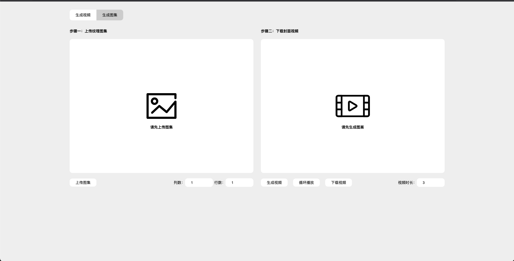

# FrameExtraction-Demo

This is a video according to the number of rows, columns, frame rate to draw frame into the picture, the picture according to the frame rate and the number of rows, generate video small tool.

Techniques used HTML, CSS, JavaScript

## UI

### Picture to Video

### Video to Picture

## Use Video

### Picture to Video

### Video to Picture

