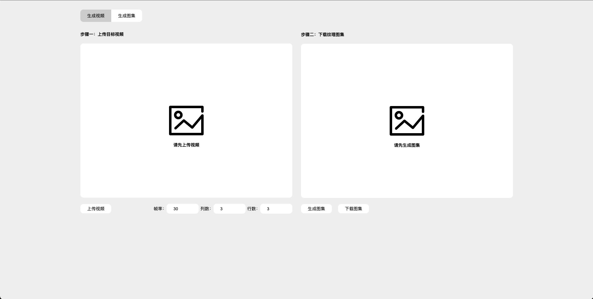
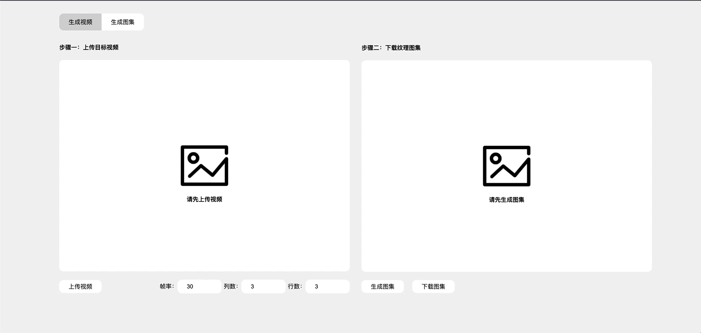
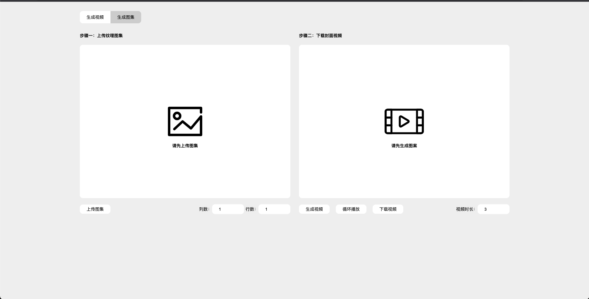
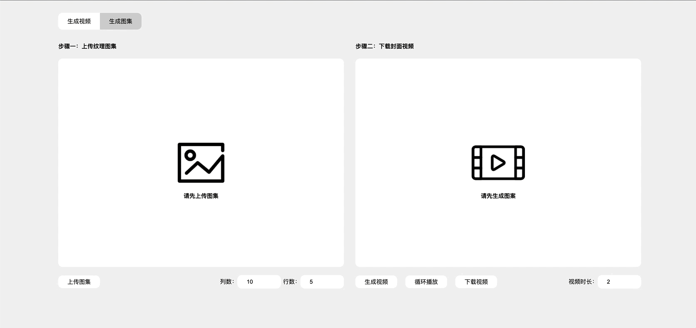

# FrameExtraction-Demo

<p align="center">
  
  
  
  
  
</p>

<p align="center">
  <b>前端视频帧提取与图片生成视频工具</b>
</p>

<p align="center">
  <a href="#项目简介">项目简介</a> •
  <a href="#功能特性">功能特性</a> •
  <a href="#技术栈">技术栈</a> •
  <a href="#项目结构">项目结构</a> •
  <a href="#快速开始">快速开始</a> •
  <a href="#使用说明">使用说明</a>
</p>

## 项目简介

FrameExtraction-Demo 是一个基于前端技术的视频帧提取和帧合成视频的工具。它可以将视频按指定的行数、列数、帧率提取成帧图片，也可以将多张图片按照指定的帧率和行列数合成为视频。所有处理都在浏览器端完成，无需后端服务器支持。

## 功能特性

- 视频转图片：将视频按指定参数提取为帧图片
- 图片转视频：将多张图片合成为视频文件
- 自定义行列数：支持自定义图片排列的行列数
- 自定义帧率：支持设置输出视频的帧率
- 实时预览：处理过程中可实时预览效果
- 纯前端实现：无需后端，保护用户隐私
- 支持多种格式：支持常见视频和图片格式

## 技术栈

| 技术 | 说明 | 版本 |
|------|------|------|
| HTML5 | 页面结构 | 5 |
| CSS3 | 样式设计 | 3 |
| JavaScript | 核心逻辑 | ES6+ |
| HTML5 Canvas | 图像处理 | - |
| Webpack | 构建工具 | 5.x |
| MediaRecorder API | 视频录制 | - |
| File API | 文件操作 | - |

## 项目结构

```
FrameExtraction-Demo/
├── README.md                    # 项目说明文档
├── package.json                 # 项目配置
├── webpack.common.js            # Webpack通用配置
├── webpack.dev.js               # Webpack开发配置
├── webpack.prod.js              # Webpack生产配置
├── .gitignore                   # Git忽略配置
├── FrameExtraction.html         # 主页面
├── css/                         # 样式文件
│   └── style.css               # 主样式
├── js/                          # JavaScript文件
│   ├── main.js                 # 入口文件
│   ├── videoToFrames.js        # 视频转帧逻辑
│   └── framesToVideo.js        # 帧合成视频逻辑
├── assets/                      # 静态资源
│   └── images/                 # 图片资源
├── PicturetoVideo.gif          # 图片转视频演示GIF
├── PicturetoVideo.png          # 图片转视频演示图
├── VideotoPicture.gif          # 视频转图片演示GIF
└── VideotoPicture.png          # 视频转图片演示图
``@

## 快速开始

### 环境要求

- Node.js >= 14.0.0
- npm >= 6.0.0
- 现代浏览器（支持HTML5 Canvas和MediaRecorder API）

### 安装

```bash
# 克隆仓库
git clone https://github.com/MoonStartMan/FrameExtraction-Demo.git

# 进入项目目录
cd FrameExtraction-Demo

# 安装依赖
npm install
```

### 运行

```bash
# 开发模式
npm run dev

# 生产构建
npm run build

# 启动生产服务器
npm start
```

### 直接使用

也可以直接在浏览器中打开 `FrameExtraction.html` 文件使用（部分功能可能需要服务器环境）。

## 使用说明

### 功能一：视频转图片 (Video to Picture)

将视频文件按设定的参数提取为帧图片。

#### 操作步骤

1. 点击 "选择视频文件" 按钮上传视频
2. 设置提取参数：
   - **行数**：图片排列的行数
   - **列数**：图片排列的列数
   - **帧率(FPS)**：每秒提取的帧数
3. 点击 "开始提取" 按钮
4. 等待处理完成，下载生成的图片

#### 参数说明

| 参数 | 说明 | 默认值 | 范围 |
|------|------|--------|------|
| 行数 | 输出图片的排列行数 | 5 | 1-20 |
| 列数 | 输出图片的排列列数 | 5 | 1-20 |
| 帧率 | 每秒提取的帧数 | 10 | 1-60 |

#### 界面预览



#### 演示效果



### 功能二：图片转视频 (Picture to Video)

将多张图片合成为视频文件。

#### 操作步骤

1. 点击 "选择图片文件" 按钮上传多张图片（支持多张图片）
2. 设置合成参数：
   - **行数**：图片排列的行数
   - **列数**：图片排列的列数
   - **帧率(FPS)**：输出视频的帧率
3. 点击 "开始合成" 按钮
4. 等待处理完成，下载生成的视频文件

#### 参数说明

| 参数 | 说明 | 默认值 | 范围 |
|------|------|--------|------|
| 行数 | 图片排列的行数 | 1 | 1-10 |
| 列数 | 图片排列的列数 | 1 | 1-10 |
| 帧率 | 输出视频的帧率 | 30 | 1-60 |

#### 界面预览



#### 演示效果



## 核心代码说明

### 视频帧提取

```javascript
/**
 * 从视频中提取帧
 * @param {HTMLVideoElement} video - 视频元素
 * @param {number} fps - 帧率
 * @param {number} rows - 行数
 * @param {number} cols - 列数
 * @returns {Promise<HTMLCanvasElement>} 包含所有帧的Canvas
 */
async function extractFrames(video, fps, rows, cols) {
    const canvas = document.createElement('canvas');
    const ctx = canvas.getContext('2d');
    
    // 计算Canvas尺寸
    const frameWidth = video.videoWidth / cols;
    const frameHeight = video.videoHeight / rows;
    canvas.width = frameWidth * cols;
    canvas.height = frameHeight * rows;
    
    const frames = [];
    const interval = 1 / fps;
    
    // 提取每一帧
    for (let time = 0; time < video.duration; time += interval) {
        video.currentTime = time;
        await new Promise(resolve => {
            video.onseeked = resolve;
        });
        
        // 绘制到Canvas
        const row = Math.floor(frames.length / cols);
        const col = frames.length % cols;
        ctx.drawImage(
            video,
            col * frameWidth,
            row * frameHeight,
            frameWidth,
            frameHeight
        );
        
        frames.push({ row, col });
    }
    
    return canvas;
}
``@

### 图片合成视频

```javascript
/**
 * 将图片合成为视频
 * @param {FileList} images - 图片文件列表
 * @param {number} fps - 帧率
 * @param {number} rows - 行数
 * @param {number} cols - 列数
 * @returns {Promise<Blob>} 视频Blob
 */
async function createVideoFromImages(images, fps, rows, cols) {
    const canvas = document.createElement('canvas');
    const ctx = canvas.getContext('2d');
    
    // 加载所有图片
    const loadedImages = await Promise.all(
        Array.from(images).map(file => {
            return new Promise((resolve, reject) => {
                const img = new Image();
                img.onload = () => resolve(img);
                img.onerror = reject;
                img.src = URL.createObjectURL(file);
            });
        })
    );
    
    // 设置Canvas尺寸
    const imgWidth = loadedImages[0].width;
    const imgHeight = loadedImages[0].height;
    canvas.width = imgWidth * cols;
    canvas.height = imgHeight * rows;
    
    // 使用MediaRecorder录制视频
    const stream = canvas.captureStream(fps);
    const mediaRecorder = new MediaRecorder(stream, {
        mimeType: 'video/webm;codecs=vp9'
    });
    
    const chunks = [];
    mediaRecorder.ondataavailable = (e) => {
        if (e.data.size > 0) {
            chunks.push(e.data);
        }
    };
    
    return new Promise((resolve) => {
        mediaRecorder.onstop = () => {
            const blob = new Blob(chunks, { type: 'video/webm' });
            resolve(blob);
        };
        
        mediaRecorder.start();
        
        // 逐帧绘制
        let frameIndex = 0;
        const drawFrame = () => {
            if (frameIndex >= loadedImages.length) {
                mediaRecorder.stop();
                return;
            }
            
            const img = loadedImages[frameIndex];
            const row = Math.floor(frameIndex / cols);
            const col = frameIndex % cols;
            
            ctx.drawImage(img, col * imgWidth, row * imgHeight);
            frameIndex++;
            
            requestAnimationFrame(drawFrame);
        };
        
        drawFrame();
    });
}
```

## 浏览器兼容性

| 浏览器 | 支持情况 | 备注 |
|--------|----------|------|
| Chrome | 完全支持 | 推荐 |
| Firefox | 完全支持 | 推荐 |
| Safari | 部分支持 | MediaRecorder支持有限 |
| Edge | 完全支持 | Chromium内核 |
| IE 11 | 不支持 | 请使用现代浏览器 |

## 性能优化建议

1. **大视频处理**：建议先压缩视频或分段处理
2. **内存管理**：处理完成后及时释放URL对象
   ```javascript
   URL.revokeObjectURL(url);
   ```
3. **帧率选择**：根据需求选择合适的帧率，过高会占用更多资源
4. **图片尺寸**：建议使用统一尺寸的图片进行合成

## 常见问题

### Q: 视频提取失败怎么办？
A: 检查浏览器是否支持WebGL，访问 [get.webgl.org](https://get.webgl.org) 测试。

### Q: 生成的视频无法播放？
A: 尝试：
1. 更换浏览器
2. 检查视频编码格式
3. 使用VLC等专业播放器测试

##3 Q: 处理大文件时浏览器卡顿？
A: 建议：
1. 降低帧率
2. 减少行列数
3. 分段处理视频

### Q: 图片合成视频后顺序不对？
A: 确保：
1. 图片文件名按顺序排列
2. 选择图片时按顺序多选

## 开发计划

- [ MDN Web Docs](https://developer.mozilla.org/) - 技术文档参考+- [Webpack](https://webpack.js.org/) - 构建工具
- [MediaRecorder API](https://developer.mozilla.org/en-US/docs/Web/API/MediaRecorder) - 视频录制

---

<p align="center">
  如果本项目对您有帮助，请给个 Star ⭐
</p>
